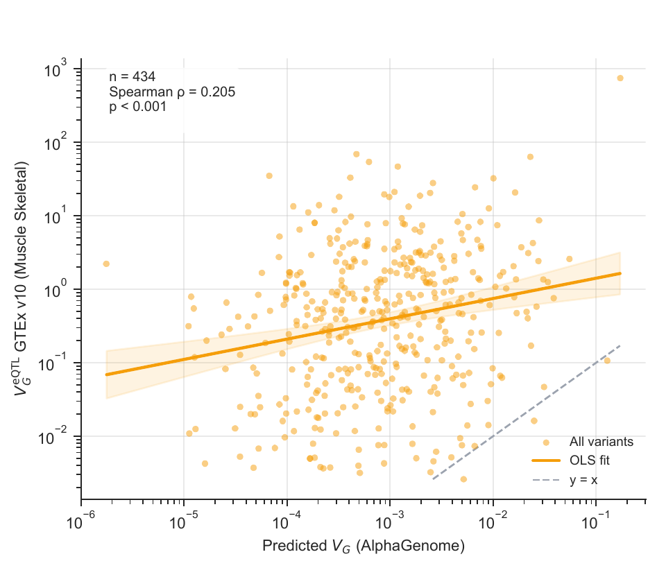
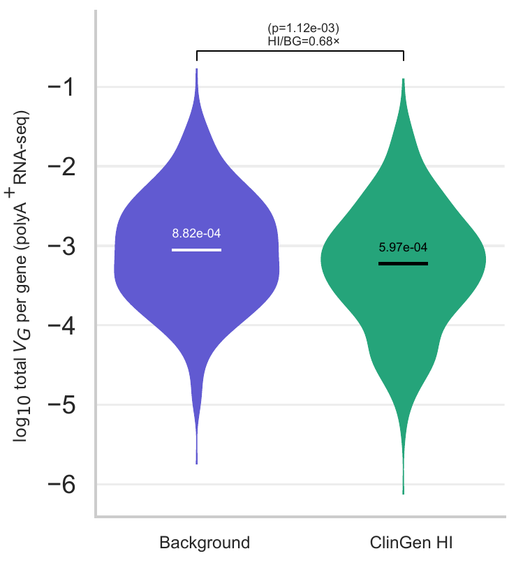
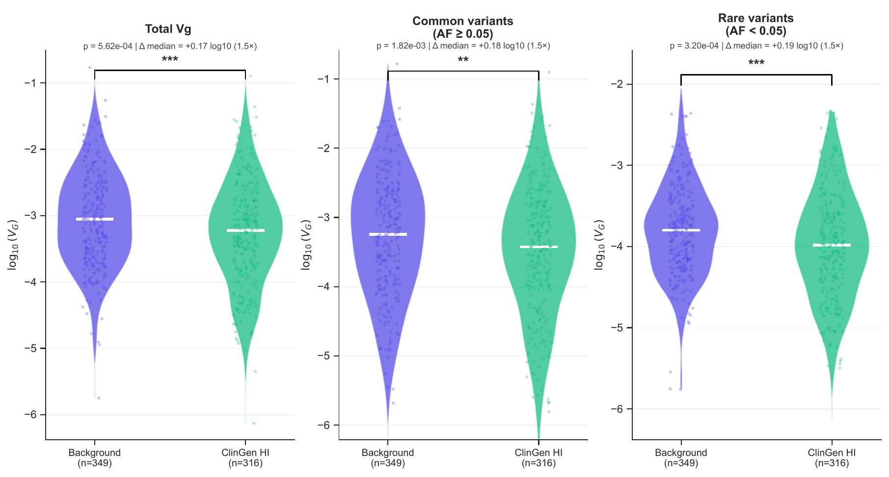
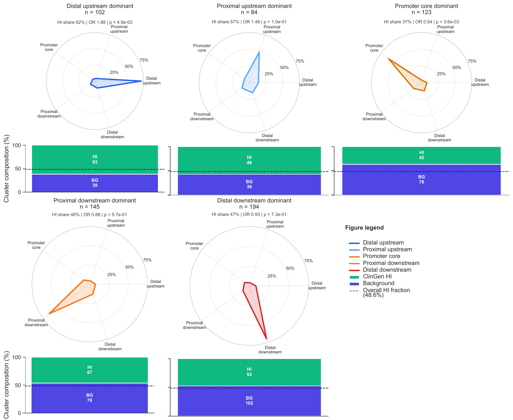

# In-Silico VG Analysis

This repository contains the downstream analysis notebooks, figures, and documentation for the thesis **Deep-Learning Prediction of Human Gene Expression Variability from Genetic Variation** (Markus Marandi, KTH Royal Institute of Technology, 2026).

It is the analysis companion to [`in-silico-genetic-variance`](https://github.com/markus-marandi/in-silico-genetic-variance), which prepares variants, runs AlphaGenome scoring, and aggregates scored variants into gene-level tables. This repository asks what those predicted expression effect sizes imply about gene-level regulatory constraint in dosage-sensitive genes.



## Scientific Aim

Haploinsufficient genes are sensitive to reduced gene dosage. Standard gene-constraint metrics capture coding intolerance, structural variation, conservation, or static epigenomic signatures, but they do not directly quantify depletion of predicted cis-regulatory expression variance.

This analysis adapts the ANEVA-style genetic-variance framework to AlphaGenome variant-effect predictions:

```text
V_G = sum_i 2 p_i (1 - p_i) beta_i^2
```

where `p_i` is allele frequency and `beta_i` is the AlphaGenome-predicted expression effect size. The thesis evaluates whether this gene-level predicted `V_G` behaves as a research screening metric for regulatory constraint.

## Research Questions

The thesis is organized around three questions:

1. **Model validation**: Does AlphaGenome produce biologically meaningful variant-effect predictions after aggregation to gene-level `V_G`?
2. **Regulatory depletion**: Do ClinGen haploinsufficient genes carry lower predicted cis-regulatory expression variance than background genes?
3. **Constraint architecture**: Where relative to the transcription start site does regulatory constraint concentrate, and is the signal allele-frequency dependent?

## Main Findings

The analysis used 316 ClinGen haploinsufficient genes and 349 background coding genes after filtering for MANE Select transcript availability, skeletal-muscle expression, and promoter non-overlap.

- **Gene-level validation was supported**: predicted `V_G` correlated with GTEx skeletal-muscle eQTL-derived `V_G` across study genes (`Spearman rho = 0.205`, `P = 4.65e-6`, `n = 434`).
- **Per-variant concordance was not supported**: among 213 matched SuSiE fine-mapped eQTL variants, AlphaGenome effect sizes showed no detectable aggregate directional concordance with eQTL effect sizes (`Spearman rho = 0.019`, `P = 0.784`).
- **ClinGen haploinsufficient genes had lower predicted regulatory variance** than background genes (median ratio `0.68x`, Mann-Whitney `P = 1.12e-3`).
- **Spatial and allele-frequency analyses were informative but require caution**: cluster-level spatial architecture suggested enrichment of ClinGen haploinsufficient genes in a distal-upstream-dominant architecture and depletion from promoter-core-dominant architecture, while synthetic-null comparisons remained partly confounded by sequence composition, especially CpG-rich promoter context.



Predicted `V_G` should be interpreted as a gene-level research screening metric, not as standalone clinical evidence for a gene or variant.

## Repository Structure

```text
in-silico-vg-analysis/
├── 10_THESIS/                    # thesis-facing notebooks and final figure generation
├── 07_permutations/              # permutation and null-model diagnostics
├── 09_3103_biweekly/             # eQTL/SuSiE and later validation analyses
├── 08_figure_outputs_to_start_somewhere/ # earlier figure development notebooks
├── 01_qc/ ... 06_AF_cutoffs/     # exploratory and legacy analysis stages
├── experiments_data/             # local/small analysis data and pointers to generated outputs
├── figures/                      # generated local figure exports, generally not tracked
├── docs/                         # public research summary, repository map, curated figures
├── utils/                        # reusable analysis helpers
└── config.py                     # local path configuration
```

See `docs/repository-map.md` for a more explicit classification of thesis-facing, exploratory, legacy, generated, and data folders.

## Thesis-Facing Analysis Layer

The most important notebooks for reproducing the thesis narrative are in `10_THESIS/`:

- `4.1.model_validation_and_baseline_characterization.ipynb`
- `4.1b_eqtl_v10_concordance.ipynb`
- `4.2.Total_Vg_global_comparison.ipynb`
- `4.2.Vg_depletion_in_haploinsufficient_genes.ipynb`
- `4.3.Spatial_architecture_of_regulatory_constraint.ipynb`
- `4.4.Allele_frequency_architecture_of_constraint.ipynb`
- `4.Supplementary_robustness_and_subclass_figures.ipynb`

The notebooks assume scored and aggregated outputs from the pipeline repository. Large generated parquet files and local scratch outputs are intentionally not treated as the clean public interface of this repository.

## Figures

Curated README figures are stored in `docs/figures/` and are derived from the thesis `Figures` directory.





## Interpretation Boundaries

The thesis supports gene-level predicted `V_G` as a promising screening metric, but not as a clinical score. Results are computational and require experimental validation before clinical use. The synthetic null is useful but imperfect: because ClinGen haploinsufficient promoters are often CpG-rich and compositionally distinct, part of the observed/null difference can reflect sequence architecture rather than purifying selection alone.

## Acknowledgements and Funding

This work was supervised by Philipp Rentzsch and Tuuli Lappalainen at the Lappalainen Lab, KTH / Science for Life Laboratory.

Computational resources were provided by the National Academic Infrastructure for Science and Information Systems (NAISS) at PDC Center for High Performance Computing, KTH Royal Institute of Technology, allocation `NAISS 2024/6-322`, and at the National Supercomputer Centre (NSC), Linköping University, allocation `Berzelius-2025-176`.

This work was supported by a Wallenberg Scholar award 2024 to T. Lappalainen from the Knut and Alice Wallenberg Foundation, grant `KAW 2023.0337`, "Functional architecture of genetic disease risk using natural variation and experimental perturbations", and by a Göran Gustavsson award 2023 to T. Lappalainen.

## Citation

If you use this repository, please cite the repository and the associated thesis. Repository metadata is provided in `CITATION.cff`.
